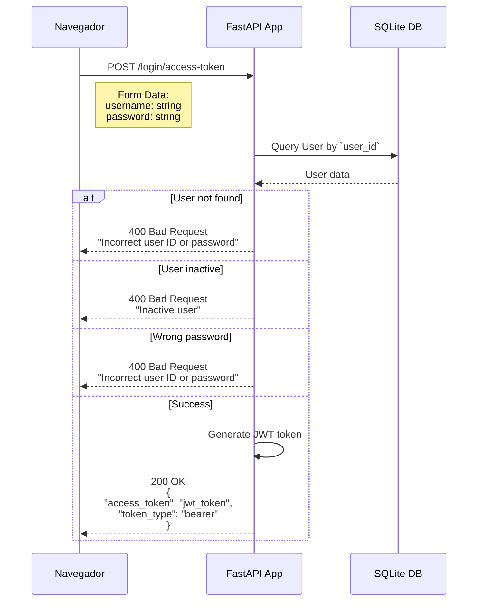
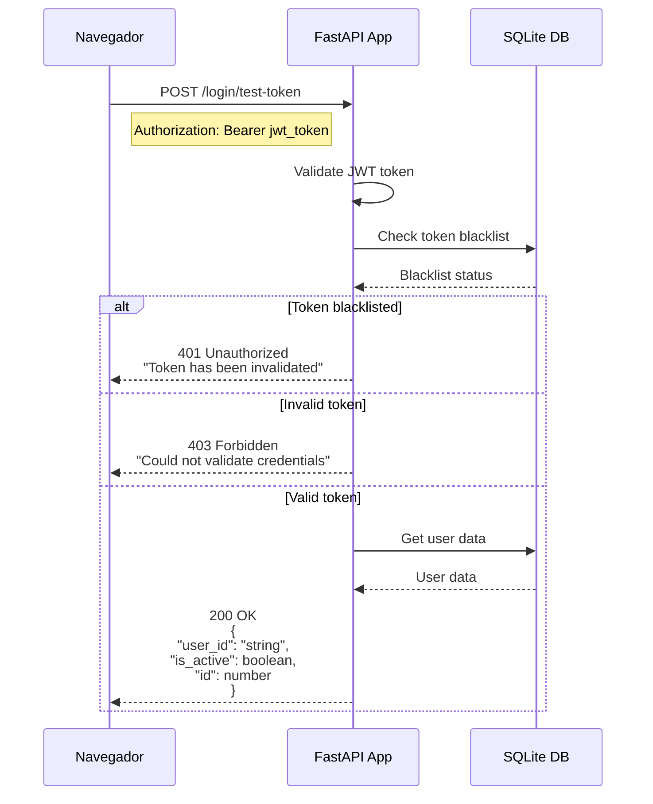
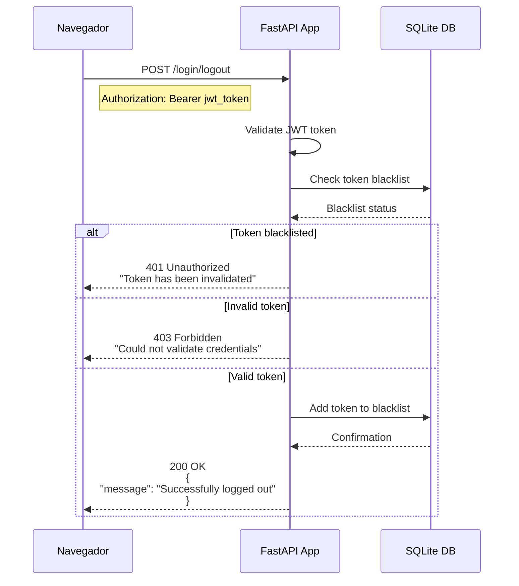
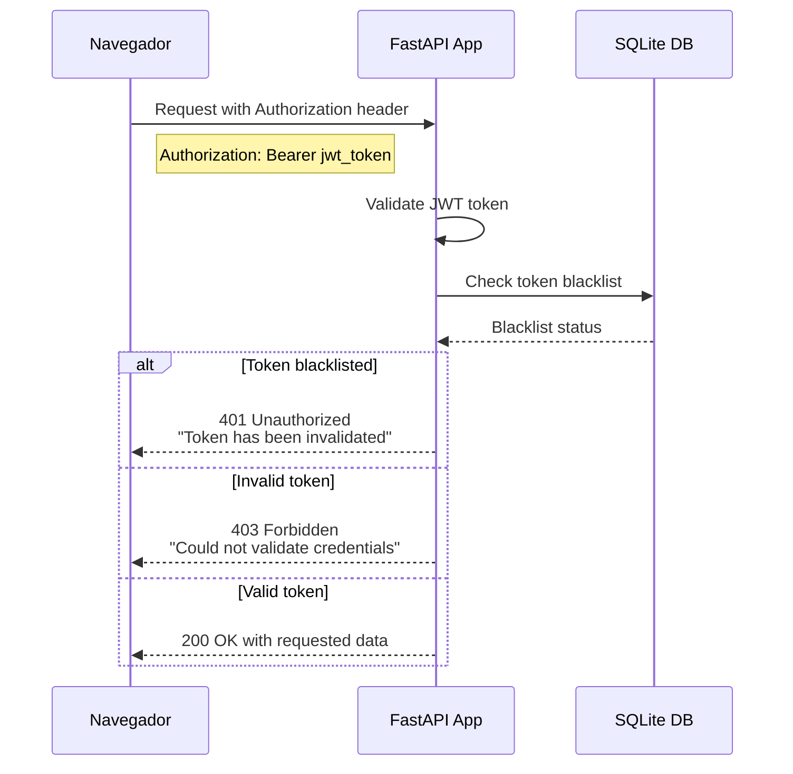

# Microservicio de usuarios

## Requerimientos de alto nivel

- Implementa el API para el flujo de autenticacion de usuarios
- Implementa la administración básica de usuarios mediante una CLI.

## Requerimientos funcionales

### Flujo de autenticacion de usuarios

### Validación de Token

### Flujo de cierre de sesión

### Protected Resource Access

## Ejecucion del microservicio de usuario

### Directamente en el anfitrión

- Abre una terminal
- Cambiate a `services/usuarios`
- Ejecuta `uv run fastapi dev` para iniciar el servidor de desarrollo de FastAPI
- Ejecuta `uv run pytest` para correr las pruebas unitarias y de integración.
- Ejecuta `uv run usuarios-cli` para iniciar la CLI de administración de usuarios.

### Usando Docker

- Abre una terminal
- Ejecuta `docker compose watch usuarios` para arrancar el microservicio de usuarios en un contenedor Docker.
- Ejecuta ` docker compose run --rm usuarios-cli` para arrancar la CLI de administración de usuarios en un contenedor Docker.
- Ejecuta `docker compose run --rm usuarios-cli dump-openapi | Out-File -Encoding UTF8 openapi/usuarios.json` para generar la documentación de la API en formato OpenAPI y guardarla en archivo `openapi/usuarios.json`. Esto sera útil para regenerar el cliente de la API de usuarios en el frontend. (Nota: si usas mac o Linux, usa el comando de redireccionamiento `>` en lugar de `| Out-File -Encoding UTF8`).
- 

